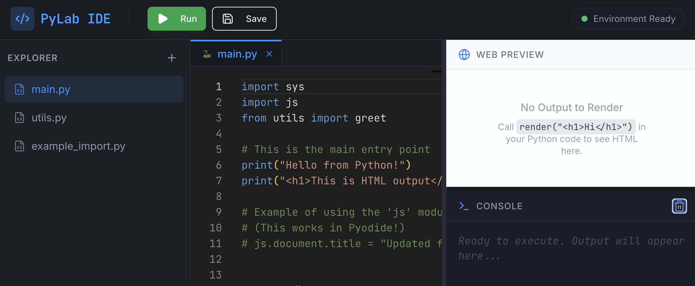

# Python REPL IDE App



A full-stack web-based IDE for executing Python code with an integrated REPL (Read-Eval-Print Loop). This application provides a modern, interactive development environment with a file explorer, console panel, and live web preview capabilities.

## Overview

This project started with inspiration from [Replit's](https://replit.com) "vibe coding" approach and has been customized with my own tweaks and adjustments to create a powerful, user-friendly Python development environment for the web.

## Features

- 🐍 **Python REPL Integration** - Execute Python code directly in the browser using Pyodide
- 📁 **File Explorer** - Manage and organize your project files
- 💻 **Console Panel** - View output, errors, and debug information in real-time
- 👁️ **Web Preview** - See rendered HTML output instantly
- 🎨 **Modern UI** - Built with React and styled with Tailwind CSS
- 📱 **Responsive Design** - Works seamlessly on desktop and mobile devices
- 🐳 **Docker Support** - Containerized setup for easy deployment
- ⚡ **Vite** - Fast build tool for development and production builds

## Tech Stack

### Frontend
- **React** - UI framework
- **TypeScript** - Type-safe development
- **Vite** - Build tool and dev server
- **Tailwind CSS** - Utility-first CSS framework
- **shadcn/ui** - Component library
- **Pyodide** - Python runtime in the browser

### Backend
- **Node.js** - Runtime
- **Express** - Web server (via Vite integration)
- **TypeScript** - Type safety
- **Drizzle ORM** - Database abstraction

### DevOps
- **Docker** - Containerization
- **Docker Compose** - Multi-container orchestration

## Getting Started

### Prerequisites
- Node.js (v18 or higher)
- npm or yarn
- Docker (optional, for containerized development)

### Installation

1. **Clone the repository**
   ```bash
   git clone https://github.com/faddah/Code-Canvas.git
   cd Code-Canvas
   ```

2. **Install dependencies**
   ```bash
   npm install
   ```

3. **Start the development server**
   ```bash
   npm run dev
   ```

   The application will be available at `http://localhost:5173` (or the port shown in your terminal).

### Docker Setup

To run the application in Docker:

```bash
docker-compose up --build
```

This will start both the application and any required services defined in `docker-compose.yml`.

## Project Structure

```
Code-Canvas/
├── client/                 # Frontend application
│   ├── src/
│   │   ├── components/    # React components
│   │   │   ├── ConsolePanel.tsx
│   │   │   ├── FileTab.tsx
│   │   │   ├── WebPreview.tsx
│   │   │   └── ui/        # shadcn/ui components
│   │   ├── hooks/         # Custom React hooks
│   │   ├── lib/           # Utilities and helpers
│   │   ├── pages/         # Page components
│   │   ├── App.tsx
│   │   └── main.tsx
│   ├── index.html
│   └── public/            # Static assets
├── server/                 # Backend application
│   ├── index.ts
│   ├── routes.ts
│   ├── db.ts
│   ├── storage.ts
│   ├── static.ts
│   └── vite.ts
├── shared/                 # Shared code
│   ├── routes.ts
│   └── schema.ts
├── script/                 # Build scripts
├── docker-compose.yml
├── Dockerfile
├── vite.config.ts
├── tsconfig.json
├── tailwind.config.ts
└── drizzle.config.ts
```

## Available Scripts

- `npm run dev` - Start development server
- `npm run build` - Build for production
- `npm run preview` - Preview production build locally

## Configuration Files

- **tsconfig.json** - TypeScript configuration
- **vite.config.ts** - Vite build configuration
- **tailwind.config.ts** - Tailwind CSS customization
- **drizzle.config.ts** - Database ORM configuration
- **postcss.config.js** - PostCSS configuration for Tailwind

## Development

### Adding New Components

Place new React components in `client/src/components/`. Use TypeScript for type safety.

### Styling

This project uses Tailwind CSS. Customize styles through `tailwind.config.ts` or use inline Tailwind classes in your components.

### Custom Hooks

Add reusable logic in `client/src/hooks/`. The project includes custom hooks for file management (`use-files`), mobile detection (`use-mobile`), Pyodide integration (`use-pyodide`), and toast notifications (`use-toast`).

## Credits

This project was inspired by [Replit's](https://replit.com) innovative "vibe coding" approach, which provided the initial foundation and philosophy for this IDE. The core implementation and additional features, optimizations, and customizations have been developed and refined independently to create this unique Python REPL IDE experience.

## License

[Specify your license here if applicable]

## Contact & Links

- **GitHub:** [github.com/faddah](https://github.com/faddah)
- **Email:** [my_biz@me.com](mailto:my_biz@me.com)

---

Happy coding! 🚀

